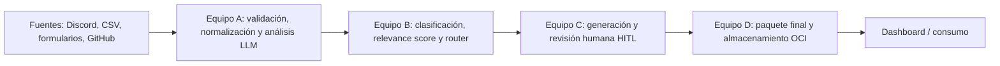

# Arquitectura de CommunityLab

## Enfoque

El diseño acordado es un **monolito modular**: una aplicación FastAPI contiene los módulos de las fases del pipeline y un frontend separado ofrecerá, como objetivo, el panel de revisión humana y dashboard. OCI Object Storage es el destino de persistencia planeado. Los límites entre equipos se expresan mediante módulos y contratos Pydantic compartidos, no mediante un contenedor por fase.

El diagrama representa el objetivo del proyecto. Las fases A, B y C ya están conectadas en un único flujo (`POST /api/v1/pipeline/process`); solo el paso D (empaquetado final + persistencia OCI) sigue sin implementar — la función que lo hace existe (`armar_respuesta_externa`) pero no está expuesta por ningún endpoint todavía.

## Módulos y propiedad funcional

| Módulo | Responsabilidad | Situación en el repositorio |
| --- | --- | --- |
| `backend/app/api` | Endpoints HTTP y routers versionados. | FastAPI con routers de ingesta, pipeline y revisión HITL implementados. |
| `backend/app/ai` | Prompts, cliente LLM y análisis estructurado. | Análisis de interacciones con Gemini implementado. |
| `backend/app/contracts` | Modelos externos/internos, enums y tipos compartidos. | Contratos centrales implementados, incluido `armar_respuesta_externa` (sin endpoint que lo invoque aún). |
| `backend/app/schemas` | Reexportar/organizar esquemas externos e internos para las capas API. | Esquemas de ingesta y pipeline implementados. |
| `backend/app/intelligence` | Clasificación, scoring y adaptación al LLM de clasificación. | Implementado y conectado al pipeline. |
| `backend/app/workflow` | Orquestación de clasificación, reintentos, fallback, enrutamiento y llamada a Equipo C. | Grafo de clasificación implementado y conectado vía `app/workflow/pipeline.py::process_batch`. |
| `backend/app/content` | Prompts de generación, selección de formato por categoría y persistencia de candidatos. | Implementado; conectado al pipeline cuando la ruta es `equipo_c.generar_activos`. |
| Revisión HITL | Listado y aprobación/edición de activos candidatos. | Implementado sobre almacenamiento JSON local (`backend/data/activos_candidatos.json`), vía `/api/v1/review`. |
| Storage OCI / empaquetado final / RAG | Persistencia definitiva, ensamblado del contrato externo final y recuperación opcional para FAQ. | Definido como objetivo; `armar_respuesta_externa` existe pero no está conectado a un endpoint ni a OCI. |
| `frontend` | Dashboard y panel HITL. | Placeholder actual; no es todavía una aplicación Streamlit. |

## Flujo implementado

`backend/app/main.py` crea la aplicación, expone `GET /health` y registra tres routers: ingesta (`/api/v1/ingest`), pipeline completo (`/api/v1/pipeline`) y revisión HITL (`/api/v1/review`).

`POST /api/v1/pipeline/process` → `process_batch` (`app/workflow/pipeline.py`) orquesta, por cada interacción del lote:

1. **Análisis (Equipo A)** — `analyze_interaction` pide a Gemini sentimiento, temas, entidades, resumen e intención; reintenta una vez y cae a un resultado neutral degradado si falla, sin abortar el lote.
2. **Clasificación, score y ruteo (Equipo B)** — el grafo de LangGraph (`build_classification_graph`) decide la categoría (`AssetCategory`), calcula `relevance_score` y la ruta de salida. Ver la sección de reglas de decisión más abajo.
3. **Generación de contenido (Equipo C)** — solo si la ruta es `equipo_c.generar_activos`, `generate_assets` pide a Gemini los formatos oficiales correspondientes a la categoría y guarda los candidatos (`pendiente`) vía `upsert_generation_result`.

Un fallo en cualquier paso se adjunta al campo `error` de esa interacción sin interrumpir el resto del lote (aislamiento de errores por ítem); ver `app/workflow/pipeline.py::process_batch`.

`POST /api/v1/ingest/process` sigue existiendo como variante que ejecuta **solo** el paso 1 (sin clasificar ni generar), útil para depurar el análisis de forma aislada.

## Reglas de decisión por categoría (Equipo B → C)

La categoría (`AssetCategory`) determina tanto el score como la ruta y, en consecuencia, si se genera contenido y de qué tipo. El flujo de decisión es:

### 1. Asignación de categoría

`classify` (nodo del grafo) pide al LLM una `PropuestaClasificacion` (categoría + confianza 0–1 + justificación), con hasta 2 intentos (`MAX_LLM_ATTEMPTS`) si hay excepción. Si ambos intentos fallan, el grafo pasa al nodo `fallback`, que usa el clasificador determinista (`classify_analysis`, basado en palabras clave e intención, sin LLM) con confianza fija `0.0`.

En el nodo `score`, si la confianza de la propuesta (LLM o fallback) es **menor a `CONFIDENCE_THRESHOLD = 0.75`**, la categoría se recalcula igualmente con el clasificador determinista — es decir, el LLM solo "gana" cuando responde con alta confianza; cualquier duda cae al criterio determinista por palabras clave:

- `solicitar_ayuda` / `reportar_problema` / `pedir_soporte` como intención, o frases como "bloqueado", "llevo tres dias", "no logro entender" → **`SUPPORT_ALERT`**.
- `compartir_logro` / `celebrar_logro` como intención, o frases como "consigue empleo", "contratacion", "termino su proyecto" → **`SUCCESS_STORY`**.
- texto con "faq" o "pregunta frecuente" → **`FAQ`**.
- intención `solicitar_ejemplo` / `aprender` / `solicitar_ayuda` junto con temas detectados → **`EDUCATIONAL_CONTENT`**.
- sentimiento ≥ 0.7 con palabras de agradecimiento/testimonio → **`COMMUNITY_HIGHLIGHT`**.
- sentimiento ≥ 0.6 con resumen no vacío → **`SOCIAL_POST`**.
- cualquier otro caso → **`IGNORE`**.

### 2. Cálculo de `relevance_score` (0–100)

`calculate_relevance_score` (`app/intelligence/scorer.py`) suma puntos independientes de la categoría asignada:

| Componente | Puntos máximos | Regla |
| --- | --- | --- |
| Intención | 30 | `compartir_logro`/`celebrar_logro` = 30; `solicitar_ejemplo`/`aprender` = 24; `solicitar_ayuda`/`reportar_problema`/`pedir_soporte` = 20; otras = 0. |
| Temas | 25 | `min(cantidad_temas, 2) / 2 * 25`. |
| Entidades | 20 | `min(cantidad_entidades, 2) / 2 * 20`. |
| Resumen | 15 | 15 si el resumen tiene ≥ 20 caracteres; si no, 0. |
| Sentimiento | 10 | Depende de la categoría (ver abajo). |

El componente de sentimiento cambia según la categoría final:
- `SUCCESS_STORY` / `COMMUNITY_HIGHLIGHT`: `max(0, sentimiento_score) * 10` (premia positividad).
- `SUPPORT_ALERT`: `min(1, |sentimiento_score|) * 10` (premia intensidad, positiva o negativa).
- Cualquier otra categoría: `(1 - |sentimiento_score|) * 5` (premia neutralidad).

Si la categoría final es `IGNORE`, el score se recorta a un máximo de **20**, sin importar cuánto sumen los demás componentes — así una interacción descartada nunca compite por prioridad con una real.

### 3. Ruteo (`route`)

| Categoría | Ruta (`enrutamiento.ruta`) | Efecto |
| --- | --- | --- |
| `SUPPORT_ALERT` | `equipo_c.revision_prioritaria` | No genera contenido; queda marcada para atención humana prioritaria antes que cualquier otra cosa. |
| `IGNORE` | `flujo.descartar` | No genera contenido; no se detectó oportunidad de comunicación. |
| Cualquier otra (`SUCCESS_STORY`, `FAQ`, `EDUCATIONAL_CONTENT`, `SOCIAL_POST`, `COMMUNITY_HIGHLIGHT`) | `equipo_c.generar_activos` | Dispara la generación de activos candidatos en Equipo C. |

### 4. Selección de formato de contenido (solo si la ruta es `equipo_c.generar_activos`)

`_formats_for` (`app/content/generator.py`) decide qué activos pedirle al LLM según la categoría:

| Categoría | Formatos generados |
| --- | --- |
| `SUCCESS_STORY` | `post_linkedin` + `destaque_newsletter_semanal` |
| `FAQ`, `EDUCATIONAL_CONTENT` | `sugerencia_contenido_faq` + `post_linkedin` |
| `COMMUNITY_HIGHLIGHT`, `SOCIAL_POST` | `post_linkedin` + `destaque_newsletter_semanal` |

Cada candidato nace en estado `EstadoAprobacion.pendiente` y requiere aprobación humana (`PATCH /api/v1/review/assets/{candidato_id}`) antes de poder considerarse para distribución. Si el LLM falla al generar, se usa contenido de respaldo por plantilla (`_fallback_content`) para no perder el candidato, pero igual queda `pendiente` de revisión.

## Principios para contribuir

- Mantener cada fase como un módulo con límites claros dentro del backend.
- Compartir tipos mediante `backend/app/contracts`; evitar redefinir contratos localmente en cada equipo.
- Separar el contrato externo oficial de los metadatos y resultados internos necesarios para trazabilidad.
- No asumir que `tipo` es una clasificación correcta: se conserva como contexto, pero las señales analíticas se extraen del texto.
- Aislar proveedores externos en funciones o módulos sustituibles y probarlos con mocks.
- Mantener los secretos fuera del repositorio y pasar configuración por el entorno.

## Contenedores de desarrollo

Compose declara un backend en el puerto `8000` y un servicio frontend placeholder. Ingesta, análisis, clasificación y workflow son módulos Python dentro del backend; no requieren contenedores separados. Ver [Deployment.md](Deployment.md) para comandos y límites actuales.
