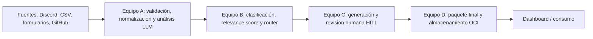

# Arquitectura de CommunityLab

## Enfoque

El diseño acordado es un **monolito modular**: una aplicación FastAPI contiene los módulos de las fases del pipeline y un frontend separado ofrecerá, como objetivo, el panel de revisión humana y dashboard. OCI Object Storage es el destino de persistencia planeado. Los límites entre equipos se expresan mediante módulos y contratos Pydantic compartidos, no mediante un contenedor por fase.

El diagrama representa el objetivo del proyecto, no el estado completamente conectado actual.

## Módulos y propiedad funcional

| Módulo | Responsabilidad | Situación en el repositorio |
| --- | --- | --- |
| `backend/app/api` | Endpoints HTTP y routers versionados. | FastAPI y endpoint de ingesta implementados. |
| `backend/app/ai` | Prompts, cliente LLM y análisis estructurado. | Análisis de interacciones con Gemini implementado. |
| `backend/app/contracts` | Modelos externos/internos, enums y tipos compartidos. | Contratos centrales implementados. |
| `backend/app/schemas` | Reexportar/organizar esquemas externos e internos para las capas API. | Esquemas de la ingesta implementados. |
| `backend/app/intelligence` | Clasificación, scoring y adaptación al LLM de clasificación. | Componentes implementados y probados individualmente. |
| `backend/app/workflow` | Orquestación de clasificación, reintentos, fallback y enrutamiento. | Grafo de clasificación implementado; aún no conectado al endpoint de ingesta. |
| Generación de activos y HITL | Prompts de generación, UI de aprobación/edición y estado de aprobación. | Definido en el plan; falta integrarlo como flujo funcional. |
| Storage / RAG | Persistencia en OCI y recuperación opcional para FAQ. | Definido como objetivo; no implementado aún. |
| `frontend` | Dashboard y panel HITL. | Placeholder actual; no es todavía una aplicación Streamlit. |

## Flujo implementado

`backend/app/main.py` crea la aplicación, registra el router de ingesta y expone `GET /health`. El router de `POST /api/v1/ingest/process` valida un lote, asigna metadatos internos y llama al analizador por interacción. El analizador usa salida estructurada validada con Pydantic, reintenta una vez y el endpoint aísla fallos por elemento con una respuesta neutral degradada.

El grafo LangGraph clasifica un `AnalisisInterno`, aplica fallback determinista si no hay salida fiable del LLM, calcula el score y selecciona una ruta. Aunque existe como módulo independiente, el endpoint de ingesta actual no lo invoca todavía.

## Principios para contribuir

- Mantener cada fase como un módulo con límites claros dentro del backend.
- Compartir tipos mediante `backend/app/contracts`; evitar redefinir contratos localmente en cada equipo.
- Separar el contrato externo oficial de los metadatos y resultados internos necesarios para trazabilidad.
- No asumir que `tipo` es una clasificación correcta: se conserva como contexto, pero las señales analíticas se extraen del texto.
- Aislar proveedores externos en funciones o módulos sustituibles y probarlos con mocks.
- Mantener los secretos fuera del repositorio y pasar configuración por el entorno.

## Contenedores de desarrollo

Compose declara un backend en el puerto `8000` y un servicio frontend placeholder. Ingesta, análisis, clasificación y workflow son módulos Python dentro del backend; no requieren contenedores separados. Ver [Deployment.md](Deployment.md) para comandos y límites actuales.
